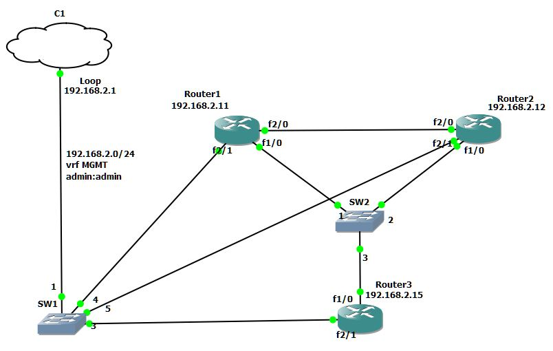

# netdev_polygon
Network automatization with python.
Test netmiko sync and async mode.

Do environment (Ubuntu)

    mkdir virtualenv  
    sudo apt install -y python3-venv  
    python3 -m venv virtualenv/netdev_polygon  
    source virtualenv/netdev_polygon/bin/activate  
    mkdir projects  
    cd projects  
    git clone https://github.com/Vostbur/netdev_polygon.git  
    pip install -r requirements.txt  

Configure devices. Base configs are at devices/config/base. Check connectivity.     

    ssh admin@192.168.2.11 -c aes256-cbc  
    ssh admin@192.168.2.12 -c aes256-cbc  
    ssh admin@192.168.2.15 -c aes256-cbc  

  

All routers is based on Cisco 7200 Software (C7200-ADVENTERPRISEK9-M), Version 12.4(24)T, RELEASE SOFTWARE (fc1)

Result on my computer:  
- sync mode (netmiko):    1m 15.678s  
- async mode (netdev):    0m 16.969s  
